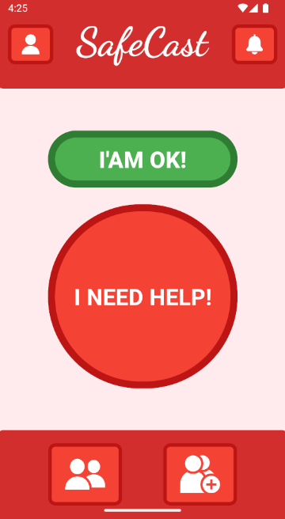
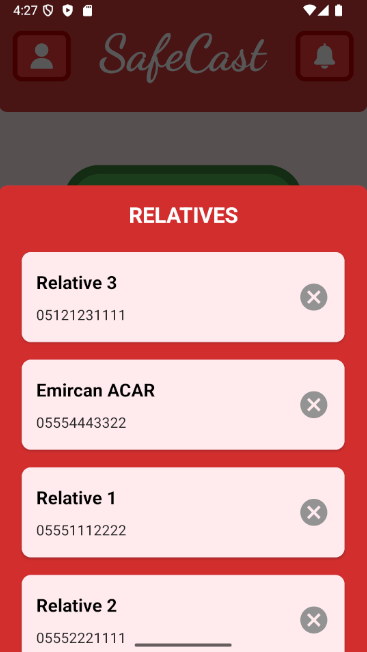
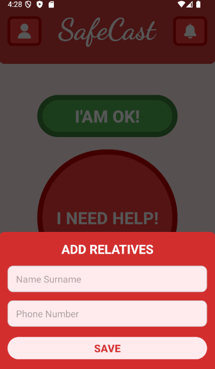
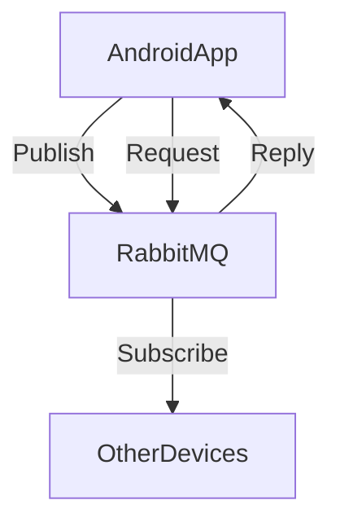

  <h3>
    <a href="#-english">English</a> | <a href="#-türkçe">Türkçe</a>
  </h3>

---

<h1 id="-english">SafeCast – Disaster Communication System</h1>

**SafeCast** is a disaster-oriented mobile communication system designed to allow users to quickly share their status and location with trusted contacts during emergency situations. The system focuses on **reliable asynchronous messaging** using RabbitMQ as the message broker.

| Main Page | Relatives List | Add Relative| Account Details |
|:---:|:---:|:---:|:---:|
|  |  |  |  |

## Key Features

* **Disaster Status Messaging:**
  * Send "I'm safe" or "I need help" messages.
  * Location data can be attached to messages.
* **Asynchronous Messaging Architecture:**
  * Event-driven communication using **RabbitMQ (AMQP)**.
  * Designed to support **Publish/Subscribe** and **Request/Reply** patterns.
* **Decentralized Communication Logic:**
  * Devices communicate through a message broker instead of direct device-to-device dependency.
  * More resilient to partial failures.
* **Expandable Architecture:**
  * Easily extendable for SMS fallback, Push notifications, and Backend microservices.

## System Architecture

The system uses a decoupled architecture where the Android client acts as both a publisher and a consumer.

## Messaging Workflow

1.  **Trigger:** User presses "I'm Safe" or "I Need Help" in the app.
2.  **Data Collection:** Application gathers User Status, Timestamp, and (Optional) Location.
3.  **Publishing:** Message is published to a specific RabbitMQ queue.
4.  **Distribution:** Subscribed clients receive the message asynchronously.
5.  **Result:** System ensures decoupled and scalable communication.

## Tech Stack

* **Mobile:** Android (Kotlin)
* **Messaging Broker:** RabbitMQ (AMQP)
* **Architecture:** Event-Driven / Message-Oriented
* **Patterns Used:** Publish/Subscribe, Request/Reply

---

<h1 id="-türkçe">SafeCast – Afet Haberleşme Sistemi</h1>

**SafeCast**, afet anlarında kullanıcıların durum ve konum bilgilerini güvenilir kişilerle hızlı bir şekilde paylaşabilmesini amaçlayan bir mobil iletişim sistemidir. Sistem, **RabbitMQ** altyapısını kullanarak asenkron ve güvenilir mesajlaşma mimarisine odaklanır.

| Ana Sayfa | Yakınların Listesi | Yakın Ekle | Hesap Detayları |
|:---:|:---:|:---:|:---:|
|  |  |  |  |

## Öne Çıkan Özellikler

* **Afet Durum Bildirimi:**
  * "İyiyim" veya "Yardıma ihtiyacım var" mesajları gönderilebilir.
  * Mesajlara konum bilgisi eklenebilir.
* **Asenkron Mesajlaşma Mimarisi:**
  * **RabbitMQ (AMQP)** üzerinden olay tabanlı (Event-driven) iletişim.
  * **Publish/Subscribe** ve **Request/Reply** desenleri uygulanmıştır.
* **Merkeziyetsiz İletişim Mantığı:**
  * Cihazlar doğrudan birbirine bağımlı olmak yerine broker üzerinden haberleşir.
  * Bu yapı sistemi hatalara karşı daha dayanıklı ve ölçeklenebilir hale getirir.
* **Genişletilebilir Mimari:**
  * SMS fallback, Push notification ve Backend mikroservis entegrasyonlarına açıktır.

## Sistem Mimarisi

Sistem, Android istemcisinin hem yayıncı (publisher) hem de tüketici (consumer) olarak davrandığı gevşek bağlı bir yapıdadır.

## Mesajlaşma Akışı

1.  **Tetikleme:** Kullanıcı uygulamada "İyiyim" veya "Yardıma ihtiyacım var" butonuna basar.
2.  **Veri Toplama:** Sistem; durum bilgisini, zaman damgasını ve (opsiyonel) konumu paketler.
3.  **Yayınlama (Publish):** Mesaj ilgili RabbitMQ kuyruğuna iletilir.
4.  **Dağıtım:** Abone olan diğer istemciler mesajı asenkron olarak alır.
5.  **Sonuç:** Gevşek bağlı (loosely coupled) ve güvenilir bir iletişim sağlanır.

## Teknoloji Yığını

* **Mobil:** Android (Kotlin)
* **Mesajlaşma Altyapısı:** RabbitMQ (AMQP)
* **Mimari:** Event-Driven / Message-Oriented
* **Kullanılan Desenler:** Publish/Subscribe, Request/Reply

---
*Developer: [Emircan Açar](https://github.com/emircanacardev)*
